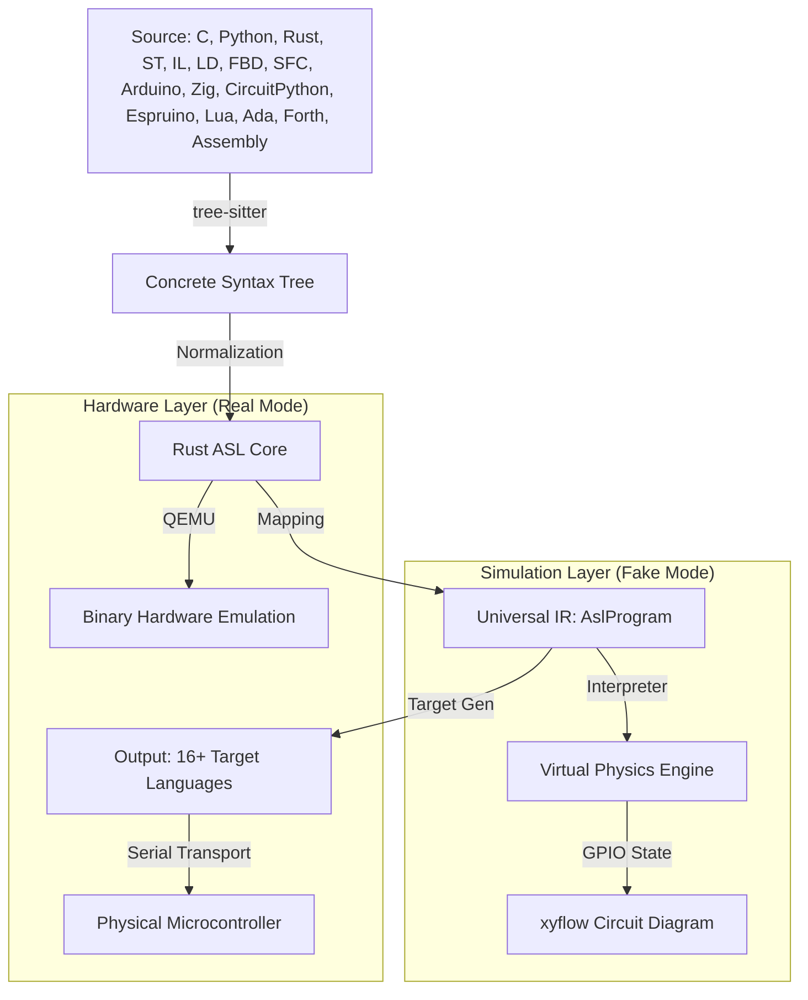

# NeuroForge Full System Map: Definitive Architecture 2026

> **Status**: APPROVED Master Reference  
> **Last Synced**: April 8, 2026  
> **Objective**: Centralize all technical, strategic, and structural specifications of the NeuroForge platform.

---

## 💎 1. Platform Vision & Core Technology

NeuroForge is a **Real-Time Microcontroller Intelligence Platform** that unifies multi-language transpilation with advanced hardware simulation. 

### 1.1 The Technology Stack

| Layer            | Technology                    | Purpose                                                   |
| :--------------- | :---------------------------- | :-------------------------------------------------------- |
| **Frontend**     | Svelte 5 (Runes), SvelteKit 2 | High-performance reactive UI                              |
| **Logic**        | Rust (Edition 2021)           | Safe, concurrent transpiler core                          |
| **Styling**      | Tailwind CSS v4               | CSS-first configuration & design tokens                   |
| **Editing**      | Monaco Editor                 | Industry-standard IDE experience                          |
| **Hardware**     | Arduino-CLI                   | Native emulation and toolchain integration                |
| **Interop**      | WebAssembly (WASM)            | Running Rust logic in-browser                             |
| **Intelligence** | Antigravity (Agentic AI)      | Specialized Hardware Engine (neuroforge-specialist agent) |

### 1.1 Supported Languages

| Category        | Languages                                                                                           |
| :-------------- | :-------------------------------------------------------------------------------------------------- |
| **Core**        | C, Python, Rust                                                                                     |
| **IEC 61131-3** | ST (Structured Text), IL (Instruction List), LD (Ladder), FBD (Function Block), SFC (Sequential)   |
| **Microcontroller** | Arduino (C++), Zig, CircuitPython, Espruino (JavaScript), Lua                                  |
| **Low-Level**   | Ada, Forth, Assembly                                                                                |

---

## 🏗️ 2. Monorepo Geometry

The project uses a **Hybrid Monorepo** managed by `pnpm` (for JS/TS) and `Cargo` (for Rust).

### 2.1 Workspace Structure

```
neuroforge/
├── apps/                    # Integrated Application Layer
│   ├── webapp/              # SvelteKit IDE (Universal)
│   ├── desktop/             # Tauri 2 IDE (Hardware Access)
│   ├── mobile/              # Tauri 2 IDE (Mobile/Tablet)
│   ├── schemasmith/         # Hardware Board Modeler (ACTIVE: Board-to-SVG Mapping)
│   └── shared/              # Physics Engine & Simulation Logic
├── crates/                  # Logic & Driver Layer (Rust)
│   ├── neuroforge-asl/      # ASL Transpiler & IR Source of Truth
│   ├── neuroforge-transport/# Serial/Network Communication (Active)
│   └── neuroforge-firmware/ # Hardware Abstraction Layer (Active)
├── .agent/                  # ACTIVE Antigravity Engine (Pro Skills & neuroforge-specialist)
├── .opencode/               # Intelligence Source (Legacy Reference & Source of Truth)
├── agent_skills/            # LLM Target Prompt Library (Protected Legacy - Future Project)
└── docs/                    # Centralized Documentation (Master Reports)
```

---

## 🧠 3. The ASL Engine & Skill Ecosystem

The heart of NeuroForge is the **ASL Engine**, supported by a specialized **Hardware Skill Ecosystem**.

### 3.1 Transpilation Pipeline



### 3.2 Ladder Logic Support

| Component       | Description                                                          |
| :-------------- | :------------------------------------------------------------------- |
| **LD-to-ASL**   | Ladder-to-ASL transformer (converts visual ladder to ASL IR)        |
| **ASL-to-LD**   | ASL-to-Ladder generator (round-trips ASL back to ladder diagrams)   |
| **LD-to-ST**    | Ladder-to-ST converter following IEC 61131-3 standard               |
| **Visual Editor** | Web-based Ladder Editor at `/plc` route in webapp                  |

**Ladder Logic Elements Supported:**
- Contacts (NO, NC) - coils (simple, latching, set/reset)
- Timers (TON, TOF, TP) - counters (CTU, CTD, CTC)
- Function blocks - structured text inline within ladder

### 3.3 Integrated Hardware Specialist (neuroforge-specialist)
The following consolidated **Pro Power Skills** have been activated for the specialized agent:
- **asl-logic-pro**: Unified grammar, fundamentals, and semantic mapping core.
- **asl-hardware-pro**: consolidated components (I2C, SPI, RGB, Motors, Storage).
- **asl-transpiler-pro**: High-fidelity generation for Arduino, MicroPython, and Rust Embassy.

---

## 📍 4. Subsystem Status & Roadmap

| Subsystem           | Status        | Priority                             |
| :------------------ | :------------ | :----------------------------------- |
| **ASL Transpiler**  | **ACTIVE**    | Core Logic                           |
| **Web/Desktop IDE** | **ACTIVE**    | UX / Developer Surface               |
| **Schemasmith**     | **ACTIVE**    | Board Modeling (SVG/TOON)            |
| **Simulator**       | **ACTIVE**    | Physics & Timing Accuracy            |
| **PLC/Ladder Editor** | **ACTIVE**  | Visual PLC Programming               |
| **Transport Crate** | **MIGRATING** | Migrating from JS to Rust            |
| **Firmware Crate**  | **MIGRATING** | Moving root board templates to crate |

---

## 🛠️ 5. Key Design Patterns

- **NeuroForge Time**: A cycle-accurate virtual clock that decouples simulation speed from real-time execution.
- **Runes-First UI**: Svelte 5 state management for zero-latency UI updates during high-frequency simulation.
- **Omni-Directional ASL**: The ability to round-trip code between any supported language without loss of semantic fidelity.

---
*Document consolidated and finalized based on physical repository audit on April 8, 2026.*
