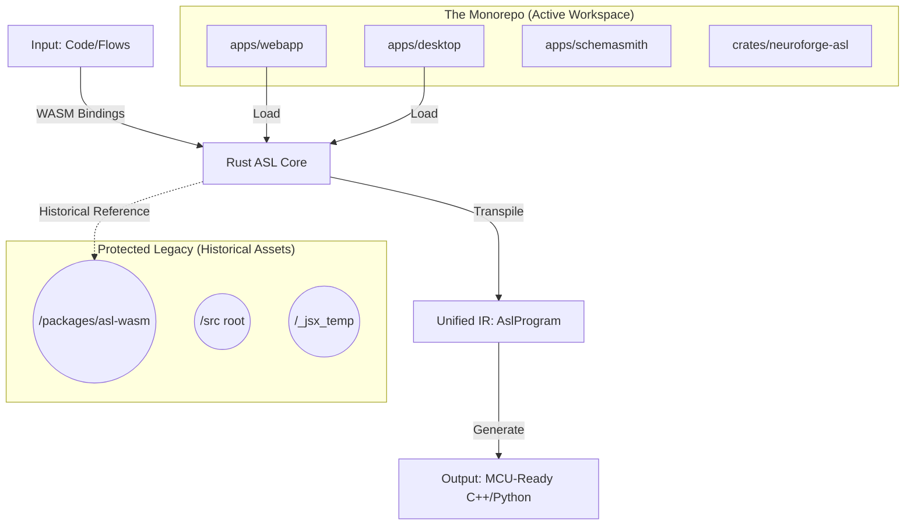

# NeuroForge Architectural Master Report: 2026 State & Alignment

> **Status**: Finalized Architectural Map
> **Date**: 2026-04-06
> **Prepared by**: Antigravity Kit (Architectural Intelligence)
> **Objective**: Define the "Current vs. Target" state of the NeuroForge monorepo and categorize legacy assets for long-term preservation.

---

## 🏗️ 1. Core System Architecture

NeuroForge has successfully transitioned into a **Rust-Centric Monorepo**. The architecture is now strictly divided into specialized layers for Transpilation, Application, and Hardware.

### 1.1. The Source of Truth: `neuroforge-asl`
The heart of the system is the **ASL (Abstract Syntax Language)** engine, implemented in Rust.
- **Location**: `crates/neuroforge-asl`
- **Function**: Multi-language parsing (C++, Python, Rust, ST) into a unified JSON IR (`AslProgram`).
- **WASM Core**: This crate is compiled for WebAssembly to power real-time transpilation in the frontend IDE without server round-trips.

### 1.2. Application Layer (PNPM Workspaces)
The user-facing environments are unified under the `apps/` directory:
- **`webapp`**: Svelte-based IDE for the browser.
- **`desktop`**: Tauri wrapper providing high-speed serial access to MCUs.
- **`schemasmith`**: Specialized tool for hardware schema modeling (TOON ➔ SVG).
- **`mobile`**: (In-Progress) Mobile-first interface implementation.

### 1.3. Simulation & Physics
- **Shared Utilities**: `apps/shared` contains the physics and timing logic used by both the web and desktop simulators.

---

## 🗺️ 2. Architectural Orphan & Forensic Map

During this audit, we identified several assets that exist outside the current monorepo geometry. Per user policy, these are treated as **Protected Legacy assets**.

### 2.1. Protected Legacy Shells (Preserved)
These represent historical structures that are currently empty but preserved for reference.

| Name | Path | Type | Status |
| :--- | :--- | :--- | :--- |
| **Empty Src** | `/src` (root) | Directory | **Preserved Shell** |
| **Empty App** | `/app` (root) | Directory | **Preserved Shell** |
| **JSX Temp** | `/_jsx_temp` | Directory | **Preserved Shell** (Subfolders verified empty) |
| **Old WASM** | `packages/asl-wasm` | Package | **Dormant Package** (Superseded by internal bundle) |

### 2.2. Active Utility Assets (Physical Remnants)
- **`bin/` Scripts**: Contains tree-generation and visualization utilities (`Generate-NeuroForge-Tree.ps1`, etc.).
- **`test_ci.ps1`**: Root CI script for hardware verification.

### 2.3. Shadow Code (Fidelity Focus)
- **ASL Types**: `apps/webapp/src/lib/asl/ASLTypes.ts` currently duplicates logic from the Rust core.
- **Strategy**: This will remain as a "Type-Only" bridge, with complex logic prioritized for the WASm core.

---

## 🔄 3. System Geometry Chart

---

## 🤖 3. Agentic Intelligence Layer

The platform is powered by a tiered agentic system designed for high-fidelity hardware orchestration.

### 3.1. Master Orchestrator (Antigravity Kit)
The primary interface for system-wide evolution and complex task routing.

### 3.2. NeuroForge Specialist (Specialized Agent)
A domain-specific expert focused exclusively on the ASL ecosystem.
- **Location**: `.agent/agents/neuroforge-specialist.md`
- **Pro Power Skills**:
    - `asl-logic-pro`: Unified grammar and semantic mapping.
    - `asl-hardware-pro`: Concentrated peripheral and bus management.
    - `asl-transpiler-pro`: Idiomatic generation for C++, Python, and Rust Embassy.

---

## 🚀 4. Long-term Archival & Preservation Strategy

Instead of deletion, the following categorization secures the architectural integrity:

1. **[PROTECTION]**: The `agent_skills/` directory is **Protected Legacy** and is preserved for future project phases (not to be deleted).
2. **[VAULTING]**: Consolidation of confirmed empty root shells (`/src`, `/app`) into a `/_history_vault` if requested.
3. **[DOCUMENTATION]**: Use the `_jsx_temp/README.md` as the primary log for ported logic verification.
4. **[INTEGRATION]**: Formalize `bin/` scripts as a `scripts/` workspace member for better discoverability.

---
*Generated by Antigravity Architectural Specialist*
