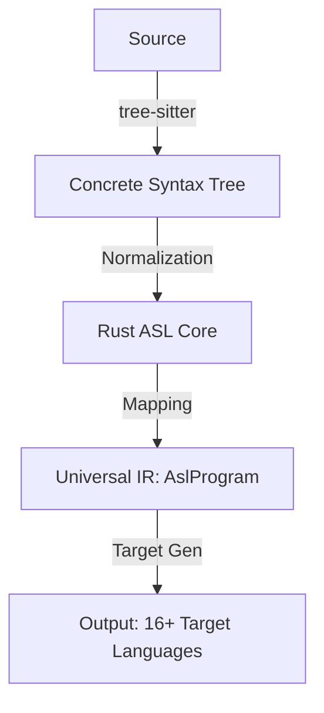

# NeuroForge Full System Map: Definitive Architecture 2026

> [!NOTE]
> **Status**: MASTER SOURCE OF TRUTH (Brain Vault)
> **Last Synced**: April 16, 2026
> **Objective**: Centralize all technical, strategic, and structural specifications of the NeuroForge platform.

---

## 🧠 0. The Digital Brain (Vault Guide)

Welcome to the NeuroForge Digital Brain. This is a local Obsidian vault designed for persistent semantic memory.

- **Index.md**: This file (Master Architecture).
- **[[Timeline/Index|Timeline/]]**: Daily logs, session history, and task progress.
- **[[Brain/Index|Brain/]]**: Semantic "neurons" - deep dives into logic, hardware, and algorithms.
- **[[graphify/GRAPH_REPORT|Graphify Report]]**: Automated structural analysis and community maps.
- **[[graphify/wiki/index|Code Wiki]]**: Auto-generated wiki from the codebase.
- **[[Rules/BRAIN_PROTOCOL|Rules/]]**: Behavioral protocols for AI agents.
- **[[Templates/Index|Templates/]]**: Standard formats for new notes.

---

## 💎 1. Platform Vision & Core Technology

NeuroForge is a **Real-Time Microcontroller Intelligence Platform** that unifies multi-language transpilation with advanced hardware simulation. 

### 1.1 The Technology Stack

| Layer            | Technology                    | Purpose                                                   |
| :--------------- | :---------------------------- | :-------------------------------------------------------- |
| **Frontend**     | Svelte 5 (Runes), SvelteKit 2 | High-performance reactive UI                              |
| **Logic**        | Rust (Edition 2021)           | Safe, concurrent transpiler core                          |
| **Styling**      | Tailwind CSS v4               | CSS-first configuration & design tokens                   |
| **Editing**      | Monaco Editor                 | Industry-standard IDE experience                          |
| **Hardware**     | Arduino-CLI                   | Native emulation and toolchain integration                |
| **Interop**      | WebAssembly (WASM)            | Running Rust logic in-browser                             |
| **Intelligence** | Antigravity (Agentic AI)      | Specialized Hardware Engine (neuroforge-specialist agent) |

---

## 🏗️ 2. Monorepo Geometry

The project uses a **Hybrid Monorepo** managed by `pnpm` (for JS/TS) and `Cargo` (for Rust).

### 2.1 Workspace Structure

```
neuroforge/
├── apps/                    # Integrated Application Layer
├── crates/                  # Logic & Driver Layer (Rust)
├── .agent/                  # ACTIVE Antigravity Engine
├── .opencode/               # Intelligence Source (Legacy Reference)
├── docs/                    # Centralized Documentation (Legacy)
└── notes/                   # ACTIVE Digital Brain (Obsidian Vault)
```

---

## 🧠 3. The ASL Engine & Skill Ecosystem

The heart of NeuroForge is the **ASL Engine**, supported by a specialized **Hardware Skill Ecosystem**.

### 3.1 Transpilation Pipeline



---

## 🛠️ 4. Key Design Patterns

- **NeuroForge Time**: A cycle-accurate virtual clock.
- **Runes-First UI**: Svelte 5 state management.
- **Omni-Directional ASL**: Round-tripping code between languages.

---
*Visit [[Timeline/Index|Today's session]] for current status.*
